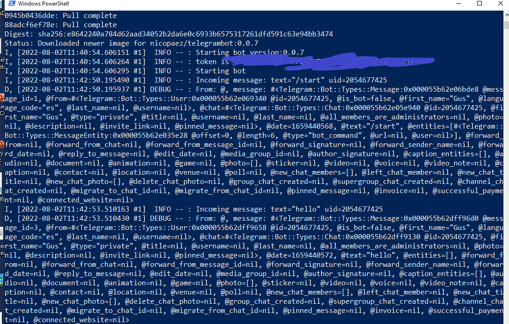

# Ejercicio 10

## Validando la imagen nicopaez/telegrambot:0.0.7 con Docker
Para esto ejecuto el siguiente comando:

    docker container run --env TELEGRAM_TOKEN=******** nicopaez/telegrambot:0.0.7

y revisando el output de la consola obtenemos:

## Aplicando Descriptor de Kuberntentes
Para aplicar el descriptor de Kubernetes, ejecutamos:

    kubectl apply -f deployment.yml

y luego para verificar revisamos con el comando 

    kubectl get all

Que retorna:

    NAME                               READY   STATUS    RESTARTS   AGE

    NAME                 TYPE        CLUSTER-IP   EXTERNAL-IP   PORT(S)   AGE
    service/kubernetes   ClusterIP   10.96.0.1    <none>        443/TCP   102d

    NAME                          READY   UP-TO-DATE   AVAILABLE   AGE
    deployment.apps/telegrambot   1/1     1            1           6s

    NAME                                     DESIRED   CURRENT   READY   AGE
    replicaset.apps/telegrambot-6ff6dd4f48   1         1         1       6s

y luego revisamos los logs con el siguiente comando:

    kubectl logs deployment.apps/telegrambot

    I, [2022-08-02T12:00:35.423095 #1]  INFO -- : Starting bot version:0.0.7
    I, [2022-08-02T12:00:35.423164 #1]  INFO -- : token is ***************************
    I, [2022-08-02T12:00:35.423191 #1]  INFO -- : Starting bot
    I, [2022-08-02T12:00:47.790598 #1]  INFO -- : Incoming message: text="/start" uid=2054677425
    D, [2022-08-02T12:00:47.790752 #1] DEBUG -- : From: @, message: #<Telegram::Bot::Types::Message:0x000055d7eaeb9700 @message_id=15, @from=#<Telegram::Bot::Types::User:0x000055d7eaec7990 @id=2054677425, @is_bot=false, @first_name="Gus", @language_code="es", @last_name=nil, @username=nil>, @chat=#<Telegram::Bot::Types::Chat:0x000055d7eaec5780 @id=2054677425, @first_name="Gus", @type="private", @title=nil, @username=nil, @last_name=nil, @all_members_are_administrators=nil, @photo=nil, @description=nil, @invite_link=nil, @pinned_message=nil>, @date=1659441646, @text="/start", @entities=[#<Telegram::Bot::Types::MessageEntity:0x000055d7ea832878 @offset=0, @length=6, @type="bot_command", @url=nil, @user=nil>], @forward_from=nil, @forward_from_chat=nil, @forward_from_message_id=nil, @forward_signature=nil, @forward_sender_name=nil, @forward_date=nil, @reply_to_message=nil, @edit_date=nil, @media_group_id=nil, @author_signature=nil, @caption_entities=[], @audio=nil, @document=nil, @animation=nil, @game=nil, @photo=[], @sticker=nil, @video=nil, @voice=nil, @video_note=nil, @caption=nil, @contact=nil, @location=nil, @venue=nil, @poll=nil, @new_chat_members=[], @left_chat_member=nil, @new_chat_title=nil, @new_chat_photo=[], @delete_chat_photo=nil, @group_chat_created=nil, @supergroup_chat_created=nil, @channel_chat_created=nil, @migrate_to_chat_id=nil, @migrate_from_chat_id=nil, @pinned_message=nil, @invoice=nil, @successful_payment=nil, @connected_website=nil>
    I, [2022-08-02T12:00:51.883347 #1]  INFO -- : Incoming message: text="/version" uid=2054677425
    D, [2022-08-02T12:00:51.884252 #1] DEBUG -- : From: @, message: #<Telegram::Bot::Types::Message:0x000055d7eae874d0 @message_id=17, @from=#<Telegram::Bot::Types::User:0x000055d7eae87458 @id=2054677425, @is_bot=false, @first_name="Gus", @language_code="es", @last_name=nil, @username=nil>, @chat=#<Telegram::Bot::Types::Chat:0x000055d7eae869b8 @id=2054677425, @first_name="Gus", @type="private", @title=nil, @username=nil, @last_name=nil, @all_members_are_administrators=nil, @photo=nil, @description=nil, @invite_link=nil, @pinned_message=nil>, @date=1659441650, @text="/version", @entities=[#<Telegram::Bot::Types::MessageEntity:0x000055d7eae85338 @offset=0, @length=8, @type="bot_command", @url=nil, @user=nil>], @forward_from=nil, @forward_from_chat=nil, @forward_from_message_id=nil, @forward_signature=nil, @forward_sender_name=nil, @forward_date=nil, @reply_to_message=nil, @edit_date=nil, @media_group_id=nil, @author_signature=nil, @caption_entities=[], @audio=nil, 
    @document=nil, @animation=nil, @game=nil, @photo=[], @sticker=nil, @video=nil, @voice=nil, @video_note=nil, @caption=nil, @contact=nil, @location=nil, @venue=nil, @poll=nil, @new_chat_members=[], @left_chat_member=nil, @new_chat_title=nil, @new_chat_photo=[], @delete_chat_photo=nil, @group_chat_created=nil, @supergroup_chat_created=nil, @channel_chat_created=nil, @migrate_to_chat_id=nil, @migrate_from_chat_id=nil, @pinned_message=nil, @invoice=nil, @successful_payment=nil, @connected_website=nil>

y Luego verifico desde telegram que este corriendo:

    https://t.me/balancitoBot

y se le solicita la version al bot con el comando /version

