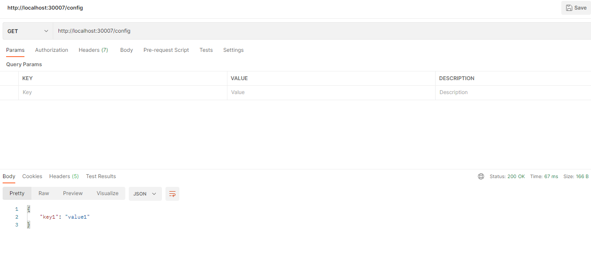
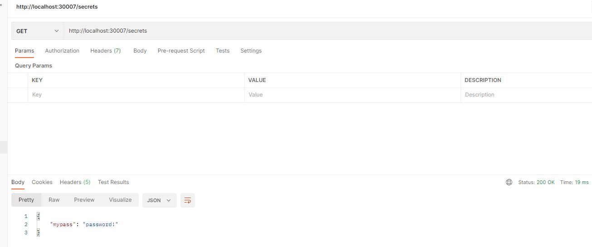

# Ejercicio 12

## Aplicando Descriptor de Kubernetes para ConfigMap1
Para aplicar el descriptor de Kubernetes, ejecutamos:

    kubectl apply -f pingapp-configmap1.yml

y luego para verificar revisamos con el comando 

    kubectl get configmap

Que retorna el configmap creado:

    NAME                 DATA   AGE
    kube-root-ca.crt     1      103d
    pingapp-configmap1   2      8s

## Aplicando Descriptor de Kubernetes para ConfigMap2
Para aplicar el descriptor de Kubernetes, ejecutamos:

    kubectl apply -f pingapp-configmap2.yml

y luego para verificar revisamos con el comando 

    kubectl get configmap

Que retorna el configmap creado:

    NAME                 DATA   AGE
    kube-root-ca.crt     1      103d
    pingapp-configmap1   2      76s
    pingapp-configmap2   1      5s

## Aplicando Descriptor de Kubernetes para Secret
Para aplicar el descriptor de Kubernetes, ejecutamos:

    kubectl apply -f pingapp-secret.yml

y luego para verificar revisamos con el comando 

    kubectl get secret

que retorna el secret creado: 

    NAME                  TYPE                                  DATA   AGE
    default-token-89q5m   kubernetes.io/service-account-token   3      103d
    pingapp-secret        Opaque                                1      5s

## Aplicando Descriptor de Kubernetes para Service NodePort
Para aplicar el descriptor de Kubernetes, ejecutamos:

    kubectl apply -f pingapp-servicenodeport.yml

y luego para verificar revisamos con el comando 

    kubectl get service

que retorna el secret creado: 

    NAME               TYPE        CLUSTER-IP      EXTERNAL-IP   PORT(S)          AGE
    kubernetes         ClusterIP   10.96.0.1       <none>        443/TCP          7m42s
    pingapp-nodeport   NodePort    10.110.58.180   <none>        4567:30007/TCP   109s

## Aplicando Descriptor de Kubernetes para Deployment de pingapp
Para aplicar el descriptor de Kubernetes, ejecutamos:

    kubectl apply -f deployment.yml

## Verificar el funcionamiento 
Para verificar ejecutamos:

    kubectl get all

y nos retorna las 3 replicas Running:

    NAME                           READY   STATUS    RESTARTS   AGE
    pod/pingapp-76b46bff8b-6glsn   1/1     Running   0          7s
    pod/pingapp-76b46bff8b-89xwg   1/1     Running   0          7s
    pod/pingapp-76b46bff8b-9hkfd   1/1     Running   0          7s

    NAME                       TYPE        CLUSTER-IP       EXTERNAL-IP   PORT(S)          AGE
    service/kubernetes         ClusterIP   10.96.0.1        <none>        443/TCP          17m
    service/pingapp-nodeport   NodePort    10.105.165.101   <none>        4567:32504/TCP   15s

    NAME                      READY   UP-TO-DATE   AVAILABLE   AGE
    deployment.apps/pingapp   3/3     3            3           7s

    NAME                                 DESIRED   CURRENT   READY   AGE
    replicaset.apps/pingapp-76b46bff8b   3         3         3       7s

## Verificar el montaje de config y secrets dentro del pod
Ingresamos dentro de un pod:

    kubectl exec -it pingapp-77f55fc75-mcm4k -- bash

y ejecutamos un curl que retorna /config:

    appuser@pingapp-77f55fc75-mcm4k:/mysecrets$ curl localhost:4567/config
    {
    "key1" : "value1"
    }

y ejecutamos un curl que retorna /secrets:

    appuser@pingapp-77f55fc75-mcm4k:/mysecrets$ curl localhost:4567/secrets
    {
        "mypass" : "password!"
    }

si revisamos las carpetas mydata y secrets estan montadas:

    appuser@pingapp-77f55fc75-mcm4k:/$ ls -la | grep my
    drwxrwxrwx   3 root    root 4096 Aug  3 02:31 mydata
    drwxrwxrwt   3 root    root  100 Aug  3 02:31 mysecrets

y dentro de /mydata esta el archivo config.json que retorna pingapp:

    appuser@pingapp-77f55fc75-mcm4k:/mydata$ ls 
    config.json

y dentro de /mysecrets esta el archivo secret.json que retorna pingapp:

    appuser@pingapp-77f55fc75-mcm4k:/mysecrets$ ls
    secret.json

## Verificar el correcto funcionamiento de NodePort service

Para esto nos conectamos desde la laptop por localhost al nodePort 30007 que apunta al 4567 de los Pods

