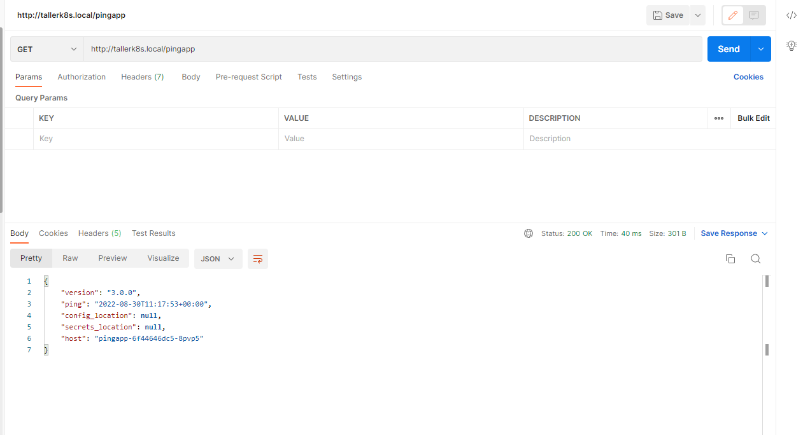
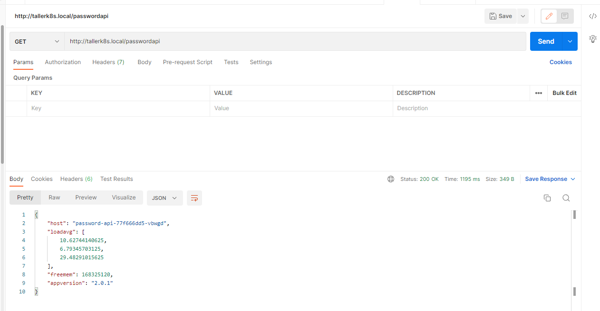

# Ejercicio 16

## Iniciando Minikube
Para iniciar minikube lo hacemos con el siguiente comando:

    minikube start --driver=docker

## Obteniendo la IP externa de minikube
Para eso ejecutamos:

    minikube ip

y nos retorna:

    192.168.59.100

## Definicion de host DNS
Se agrega una entry de host en el archivo hosts de la carpeta C:\windows\system32\drivers\etc:

    192.168.59.100 tallerk8s.local 

## Instalando NGINX Ingress Controller de host DNS
Para esto ejecutamos:

    minikube addons enable ingress

Luego para verificar ejecutamos:

    minikube addons list

y obtenemos:

    |-----------------------------|----------|--------------|--------------------------------|
    |         ADDON NAME          | PROFILE  |    STATUS    |           MAINTAINER           |
    |-----------------------------|----------|--------------|--------------------------------|
    | ambassador                  | minikube | disabled     | 3rd party (Ambassador)         |
    | auto-pause                  | minikube | disabled     | Google                         |
    | csi-hostpath-driver         | minikube | disabled     | Kubernetes                     |
    | dashboard                   | minikube | disabled     | Kubernetes                     |
    | default-storageclass        | minikube | enabled ✅   | Kubernetes                     |
    | efk                         | minikube | disabled     | 3rd party (Elastic)            |
    | freshpod                    | minikube | disabled     | Google                         |
    | gcp-auth                    | minikube | disabled     | Google                         |
    | gvisor                      | minikube | disabled     | Google                         |
    | headlamp                    | minikube | disabled     | 3rd party (kinvolk.io)         |
    | helm-tiller                 | minikube | disabled     | 3rd party (Helm)               |
    | inaccel                     | minikube | disabled     | 3rd party (InAccel             |
    |                             |          |              | [info@inaccel.com])            |
    | ingress                     | minikube | enabled ✅   | Kubernetes                     |
    | ingress-dns                 | minikube | disabled     | Google                         |
    | istio                       | minikube | disabled     | 3rd party (Istio)              |
    | istio-provisioner           | minikube | disabled     | 3rd party (Istio)              |
    | kong                        | minikube | disabled     | 3rd party (Kong HQ)            |
    | kubevirt                    | minikube | disabled     | 3rd party (KubeVirt)           |
    | logviewer                   | minikube | disabled     | 3rd party (unknown)            |
    | metallb                     | minikube | disabled     | 3rd party (MetalLB)            |
    | metrics-server              | minikube | disabled     | Kubernetes                     |
    | nvidia-driver-installer     | minikube | disabled     | Google                         |
    | nvidia-gpu-device-plugin    | minikube | disabled     | 3rd party (Nvidia)             |
    | olm                         | minikube | disabled     | 3rd party (Operator Framework) |
    | pod-security-policy         | minikube | disabled     | 3rd party (unknown)            |
    | portainer                   | minikube | disabled     | 3rd party (Portainer.io)       |
    | registry                    | minikube | disabled     | Google                         |
    | registry-aliases            | minikube | disabled     | 3rd party (unknown)            |
    | registry-creds              | minikube | disabled     | 3rd party (UPMC Enterprises)   |
    | storage-provisioner         | minikube | enabled ✅   | Google                         |
    | storage-provisioner-gluster | minikube | disabled     | 3rd party (Gluster)            |
    | volumesnapshots             | minikube | disabled     | Kubernetes                     |
    |-----------------------------|----------|--------------|--------------------------------|

y verificamos con el siguiente comando que esten corriendo los pods del namespace de ingress-nginx:

    kubectl get pods -n ingress-nginx

y obtenemos:

    NAME                                        READY   STATUS      RESTARTS        AGE
    ingress-nginx-admission-create-vsrr6        0/1     Completed   0               9d
    ingress-nginx-admission-patch-8fd5s         0/1     Completed   0               9d
    ingress-nginx-controller-755dfbfc65-mqtp9   1/1     Running     2 (9m18s ago)   9d

## Precarga de imagenes en minikube
Como las imagenes pueden ser muy pesada, el deploy puede tener el status (me sucedio)  ImagePullBackOff y el proceso de deploy puede fallar. \
Para cachear la imagen utilizamos el siguiente comando:

    minikube image load nicopaez/password-api:2.0.1
    minikube image load nicopaez/pingapp:3.0.0

Luego para comprobar que se guardo en el almacen ejecutamos:

    minikube image list

y obtenemos

    k8s.gcr.io/pause:3.7
    k8s.gcr.io/pause:3.6
    k8s.gcr.io/kube-scheduler:v1.24.1
    k8s.gcr.io/kube-proxy:v1.24.1
    k8s.gcr.io/kube-controller-manager:v1.24.1
    k8s.gcr.io/kube-apiserver:v1.24.1
    k8s.gcr.io/ingress-nginx/kube-webhook-certgen:<none>
    k8s.gcr.io/ingress-nginx/controller:<none>
    k8s.gcr.io/etcd:3.5.3-0
    k8s.gcr.io/coredns/coredns:v1.8.6
    gcr.io/k8s-minikube/storage-provisioner:v5
    docker.io/nicopaez/pingapp:3.0.0
    docker.io/nicopaez/password-api:2.0.1

## Para iniciar pingapp Descriptor de Kubernetes
Para aplicar el descriptor de Kubernetes, ejecutamos:

    kubectl apply -f deployment-pingapp.yml

Para verificar revisamos con el comando 

    kubectl get all -l app=pingapp

Que retorna la replicas creadas:

    NAME                           READY   STATUS    RESTARTS   AGE
    pod/pingapp-6f44646dc5-8pvp5   1/1     Running   0          10m

    NAME              TYPE        CLUSTER-IP      EXTERNAL-IP   PORT(S)    AGE
    service/pingapp   ClusterIP   10.108.135.69   <none>        4567/TCP   9m44s

    NAME                      READY   UP-TO-DATE   AVAILABLE   AGE
    deployment.apps/pingapp   0/1     1            0           10m

    NAME                                 DESIRED   CURRENT   READY   AGE
    replicaset.apps/pingapp-6f44646dc5   1         1         0       10m

## Para aplicar Descriptor de service a pingapp 
Ejecutamos:

    kubectl apply -f service-pingapp.yml

Para verificar revisamos con el comando 

    kubectl describe service pingapp

Que retorna el detalle del servicio creado:

    Name:              pingapp
    Namespace:         default
    Labels:            app=pingapp
    Annotations:       <none>
    Selector:          app=pingapp
    Type:              ClusterIP
    IP Family Policy:  SingleStack
    IP Families:       IPv4
    IP:                10.108.135.69
    IPs:               10.108.135.69
    Port:              <unset>  4567/TCP
    TargetPort:        4567/TCP
    Endpoints:         172.17.0.4:4567
    Session Affinity:  None
    Events:            <none>

## Para iniciar password-api Descriptor de Kubernetes
Para aplicar el descriptor de Kubernetes, ejecutamos:

    kubectl apply -f deployment-password-api.yml

Para verificar revisamos con el comando 

    kubectl get all -l app=password-api

Que retorna la replicas creadas:

    NAME                               READY   STATUS    RESTARTS   AGE
    pod/password-api-77f666dd5-vbwgd   1/1     Running   0          11m

    NAME                   TYPE        CLUSTER-IP       EXTERNAL-IP   PORT(S)    AGE
    service/password-api   ClusterIP   10.104.238.104   <none>        3000/TCP   11m

    NAME                           READY   UP-TO-DATE   AVAILABLE   AGE
    deployment.apps/password-api   1/1     1            1           11m

    NAME                                     DESIRED   CURRENT   READY   AGE
    replicaset.apps/password-api-77f666dd5   1         1         1       11m

## Para aplicar Descriptor de service a password-api 
Ejecutamos:

    kubectl apply -f service-password-api.yml

Para verificar revisamos con el comando 

    kubectl describe service password-api

Que retorna el detalle del servicio creado:
    Name:              password-api
    Namespace:         default
    Labels:            app=password-api
    Annotations:       <none>
    Selector:          app=password-api
    Type:              ClusterIP
    IP Family Policy:  SingleStack
    IP Families:       IPv4
    IP:                10.104.238.104
    IPs:               10.104.238.104
    Port:              <unset>  3000/TCP
    TargetPort:        3000/TCP
    Endpoints:         172.17.0.5:3000
    Session Affinity:  None
    Events:            <none>

## Para aplicar Descriptor de Ingress a pingapp 
Ejecutamos:

    kubectl apply -f nginx-ingress.yml

Para verificar revisamos con el comando 

    kubectl describe ingress nginx-ingress

Que retorna el detalle del servicio creado:

    Name:             nginx-ingress
    Labels:           <none>
    Namespace:        default
    Address:          192.168.59.100
    Ingress Class:    nginx
    Default backend:  <default>
    Rules:
    Host             Path  Backends
    ----             ----  --------
    tallerk8s.local
                    /pingapp       pingapp:4567 (172.17.0.4:4567)
                    /passwordapi   password-api:3000 (172.17.0.5:3000)
    Annotations:       nginx.ingress.kubernetes.io/rewrite-target: /$1
    Events:
    Type    Reason  Age                  From                      Message
    ----    ------  ----                 ----                      -------
    Normal  Sync    6m49s (x4 over 14m)  nginx-ingress-controller  Scheduled for sync
    
## Verificar el correcto funcionamiento de Ingress

Para esto nos conectamos desde la laptop y accedemos a tallerk8s.local

